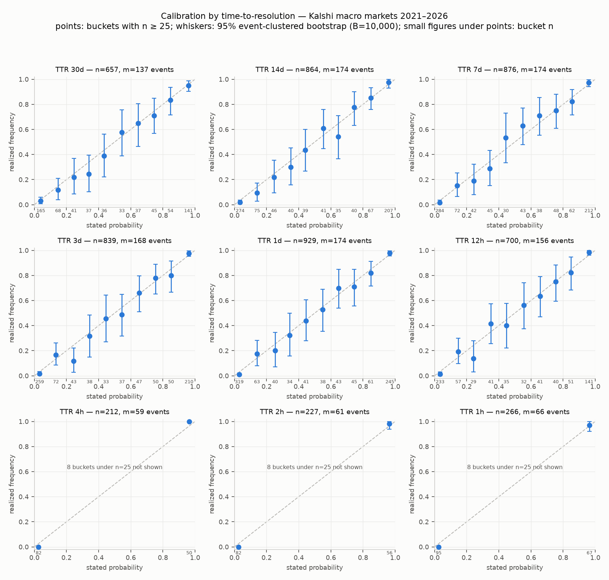

# Kalshi Macro-Release Event Study

An empirical study of price discovery in Kalshi prediction markets around scheduled U.S. macroeconomic releases — CPI, the jobs report, FOMC rate decisions, and weekly jobless claims — built on market data collected by this repository's own instruments and analyzed under a publicly pre-registered methodology.

**Status (July 2026):** the historical calibration study is complete (first results below); the C++ collection daemon and its Python companion instruments are built, tested, and commissioned against the live venue; live release captures are underway.

## Research questions

1. **Pre-announcement behavior (RQ1).** Do contract prices drift ahead of scheduled release timestamps, or hold steady until the news lands? Measured on the release's own contract ladder up to its trading halt, against matched quiet-day controls — plus a companion question: how much of the eventual outcome is already priced at the moment the ladder freezes?
2. **Adjustment speed (RQ2, amended).** A structural discovery reshaped this question, and the amendment is part of the record: Kalshi **halts each release's own ladder minutes before the print** (CPI closes at 8:25 AM ET for an 8:30 release), so post-release adjustment is unobservable on the release's own contract. RQ2 therefore measures **cross-market information diffusion**: how fast the release propagates into pre-registered *response instruments* that verifiably trade through it — primarily the forward Fed-funds ladder, with next-period same-series ladders and S&P 500 intraday markets as triangulation. Adjustment speed uses a fractional metric (time to complete p% of the instrument's own realized move), which is invariant to how strongly a given instrument responds. This mirrors the fed-funds-futures announcement literature, where news is read off a correlated forward instrument.
3. **Calibration (RQ3).** Treating prices as probabilities, how well calibrated are they as a function of time-to-resolution, across the full 2021–2026 history of settled macro markets? **Complete — results below.**
4. **Does the market learn? (RQ4, stretch.)** Is price discovery faster or better calibrated for high-surprise versus low-surprise releases, with surprise measured against consensus expectations?

The complete operational specification — statistical machinery, event-inclusion rules, price-source hierarchy, and the dated amendment log — is published in [METHODOLOGY.md](METHODOLOGY.md).

## Method and instruments

Data collection is capture-first: every WebSocket frame is timestamped on receipt with both wall and monotonic clocks and appended verbatim to append-only JSONL tapes; parsing is a replay-time concern, so no interpretation bug can cost an observation.

- **C++ collector daemon** — the production instrument: a three-thread design (network callback does exactly two things: stamp and enqueue; a dedicated writer owns the tape; a supervisor owns reconnection with fresh per-attempt authentication), sequence-gap detection with automatic re-snapshots, and a venue-pushback tripwire.
- **Python capture instruments** — a WebSocket recorder (same tape contract, reconnect logic proven against a scripted fault-injecting test server) and a release-morning REST poller (drift-free 1 Hz grid that degrades gracefully under rate limiting rather than dying mid-event). A live rehearsal on the July 9 jobless-claims release ran both to completion; at matched timestamps the two instruments agreed on the top of book in over 99.7% of ~16,600 comparisons.
- **Replay and analysis layer** — order-book reconstruction from the tapes with the pre-registered chain-integrity rule enforced in code (a sequence anomaly inside an analysis window excludes that window), an event-aligned analysis pipeline, and calibration machinery with uncertainty from bootstrap resampling **clustered at the event level**, because strikes that settle on the same print are one draw from nature, not many.

## Results

Calibration as a function of time-to-resolution (RQ3), computed from 5,570 probability observations across 180 macro release events settling 2021–2026, under the price-source rules locked in [METHODOLOGY.md](METHODOLOGY.md) before any curve was inspected:



- **Prices are well-calibrated at every horizon.** The reliability (miscalibration) component of the Brier score sits between 0.0006 and 0.0066 across all nine time-to-resolution bands (0 = perfect), with 95% event-clustered bootstrap intervals (B = 10,000).
- **Prices sharpen honestly as the release approaches.** Resolution rises from 0.135 at 30 days out to ≈ 0.17 in the final hours while reliability stays pinned near zero — the pre-registered hypothesis. The overall Brier score falls from 0.114 to ≈ 0.08.
- **The headline is robust to the pre-registered sensitivity grid:** pooled Brier 0.0907–0.0922 across spread caps of 5¢/10¢/20¢.
- **Companion figures:** the [Brier decomposition](figures/brier_decomposition.png) and the [extreme-bucket quoting-artifact check](figures/artifact_check.png) (a small ≈ 1–2¢ longshot reliability gap sits inside the boundary-artifact zone anticipated by the methodology and is examined there). Every figure states n, the event-cluster count, and B; buckets under n = 25 are not drawn.

RQ1/RQ2 results accumulate as live releases are captured; each event adds one observation, and results will be reported with their sample sizes — nulls as nulls.

## Timeline

| When | What |
|---|---|
| 2021-07 → 2026-06 | Historical settled-market sample: 1,933 markets across five macro series (acquired, calibration complete) |
| 2026-07-09 | Live rehearsal: weekly jobless-claims release captured end-to-end by both Python instruments |
| 2026-07-14 | June CPI release — first full live capture (all instruments) |
| 2026-07-29 | July FOMC decision — first capture with the C++ collector as production instrument |
| Fall 2026 | Live event accumulation for RQ1/RQ2; full event-study writeup |

## Repository layout

| Path | Contents |
| --- | --- |
| `collector/` | C++ collection daemon (CMake/vcpkg; OpenSSL-signed WebSocket auth; tested) |
| `analysis/` | Capture instruments (recorder, poller), replay engine, release calendar, calibration analysis, tests |
| `figures/` | Published aggregated results (the only data-derived artifacts in this repository) |
| `data/` | Local captures — not tracked; see compliance below |

## Limitations

- **Latency floor.** Every recorded timestamp is the true event time plus a positive network delay, so measured adjustment times are upper bounds. The delay is measured continuously (round-trip and server-timestamp logs) and reported alongside results, not assumed away.
- **Clock error.** Wall-clock error is bounded by logged offset measurements; durations are computed on the monotonic clock, which cannot step.
- **Small live-capture sample.** Scheduled macro releases arrive roughly monthly per series; live-capture confidence intervals will be wide and honest about it. Weekly jobless claims are included specifically to build statistical power.
- **Single venue.** Results describe Kalshi, not prediction markets in general.
- **Liquidity, spreads, and fees.** Wide or one-sided books are an error bar on any mid-price; the methodology's spread-aware price-source rules and quoting-artifact checks exist for exactly this reason, and any deviation must clear series- and role-specific round-trip costs before being called exploitable rather than merely detectable.
- **Regime dependence.** A sample collected in one macro regime may not generalize; resampling quantifies noise, not representativeness.

## Data and compliance

Market data is collected through Kalshi's documented public API for non-commercial academic research. No trading, ever. **Raw market data is not included in this repository and is not redistributed in any form** — only aggregated statistical outputs (figures, tables, summary statistics) appear here, and the collection code lets anyone regenerate the underlying dataset themselves. Market data is provided by and attributed to [Kalshi](https://kalshi.com). Public market-data endpoints require no credentials; the collector's API credentials live in a local `.env` file, gitignored from the first commit.

## Pre-registration

The methodology — research questions, statistical machinery, exclusion rules, price-source hierarchy, and the dated amendment log — was published in [METHODOLOGY.md](METHODOLOGY.md) **before any analysis results existed**, and the commit timestamps prove the ordering. Discoveries that forced design changes (most notably the pre-print trading halt behind the RQ2 amendment) are recorded as dated amendments rather than silent rewrites, locked before the affected data was analyzed, with sensitivity grids pre-registered alongside every tunable parameter.

## Setup

Windows:

```
py -3.12 -m venv .venv
.venv\Scripts\python -m pip install -r requirements.txt
.venv\Scripts\python analysis\snapshot_probe.py    # snapshot one live macro market
.venv\Scripts\python -m pytest                     # run the tests
```

macOS/Linux:

```
python3 -m venv .venv
.venv/bin/python -m pip install -r requirements.txt
.venv/bin/python analysis/snapshot_probe.py
.venv/bin/python -m pytest
```

Building the collector additionally requires CMake, a C++20 toolchain, and vcpkg (`collector/vcpkg.json` declares the dependencies).

## License

MIT. The license covers the code and text in this repository; no license is granted to Kalshi market data, none of which is included here.
